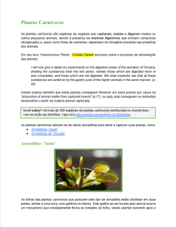
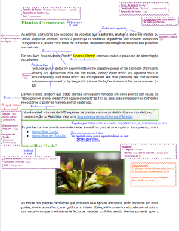
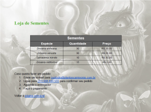
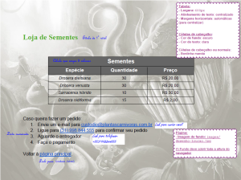

# Plantas Carnívoras 🦖

Um site informativo sobre plantas carnívoras.

## Atividade

Você tem um novo hobby: **criar plantas carnívoras**. Você encontrou um
documento solto em um antigo livro do seu tio Epaminondas e, depois de lê-lo,
decidiu **criar uma página web com seu conteúdo**. Além disso, você também tem
uma **pequena loja de sementes** dessas plantas e deseja divulgá-la em uma
página web.


### Exercício 1




Você deve pegar o documento do seu tio (arquivo:
`/documentos-do-tio/pagina-inicial-specs.pdf`) e criar uma página web com o
mesmo conteúdo e formatação. Observe que é possível abrir o PDF para
copiar/colar o texto (não perca tempo digitando =). Salve o arquivo como 
`index.html` (ver [FAQ](#faq)).
  - A pasta `/imagens` contém os arquivos de imagens a serem usados.


Você pode ver todas as _tags_ que precisará nos slides da aula. Veja
algumas diretrizes úteis para você marcar o texto sobre as plantas
carnívoras do tio Epaminondas:

- Termos **em latim** (exceto nomes próprios) devem estar
  enfatizados (há uma _tag_ para texto enfatizado).
- **Citações**, que estão em inglês, devem aparecer em itálico 
  (há duas _tags_ para citação, e você deve estilizá-las para que
  elas façam o texto ficar em itálico em vez de usar a mesma 
  _tag_ dos termos em latim). Veja no [FAQ](#faq) a propriedade para
  deixar o texto em itálico.
- Há um parágrafo "Você Sabia?" que deve ser estilizado de maneira distinta.
  Para estilizar 1 único elemento de maneira distinta, podemos atribuir um
  atributo `id="identificador-do-element"` nele. Veja no [FAQ](#faq).


### Exercício 2




Criar a página da loja seguindo o modelo do arquivo  
`/documentos-do-tio/pagina-loja-specs.pdf`. Depois de criada, salve o arquivo
como `loja.html`. Você deve também criar um hyperlink da página `index.html`
para sua nova `loja.html`, e vice-versa.


### Exercício 3

Agora que você já criou as duas páginas e estilizou as duas, deve ter
criado regras de formatação em CSS dentro de elementos `<style></style>`
nas duas páginas.

Para evitar repetição de código, é possível escrever código CSS em um arquivo
separado e incluí-lo em cada arquivo html. Isso se chama **refatorar**:

- Em vez de:
  ```html
    ...
    <style>
      ...
    </style>
  </head>
  ```
- Você pode:
  ```html
  <link rel="stylesheet" href="arquivo-de-estilos.css">
  ```

- E mover suas regras CSS **dentro de** `<style>` para o novo `arquivo-de-estilos.css`.

Note que, caso existam regras que só se apliquem a uma página, e não às duas,
você deve criar outro(s) arquivo(s) CSS para conter apenas as regras
exclusivas de cada página. Por exemplo, considere esta estrutura de pasta:
  - `cefet-web-piranha-plant`
    - `images`
      - `...`
    - `css`
      - `estilos-comuns.css`
      - `estilos-plantas.css`
      - `estilos-loja.css`
    - `...`
